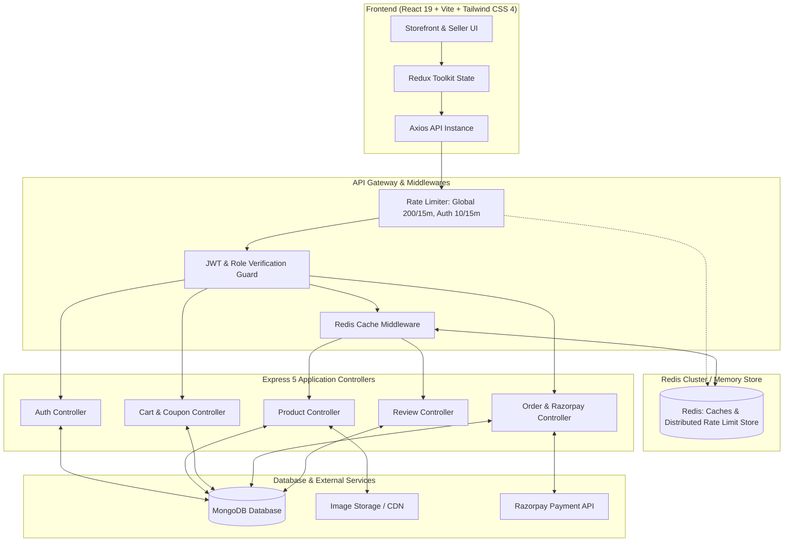
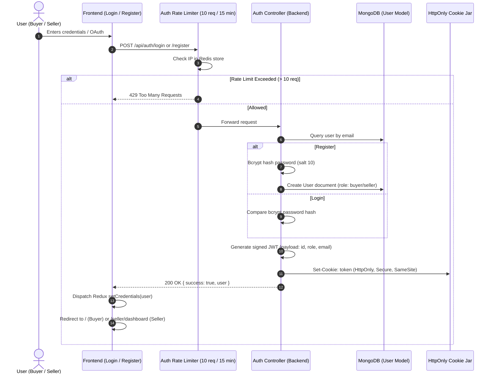
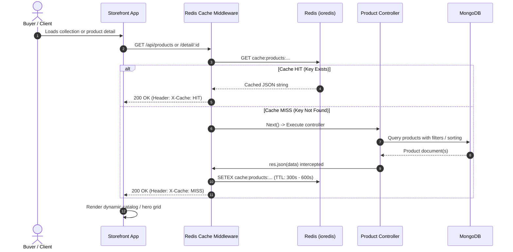
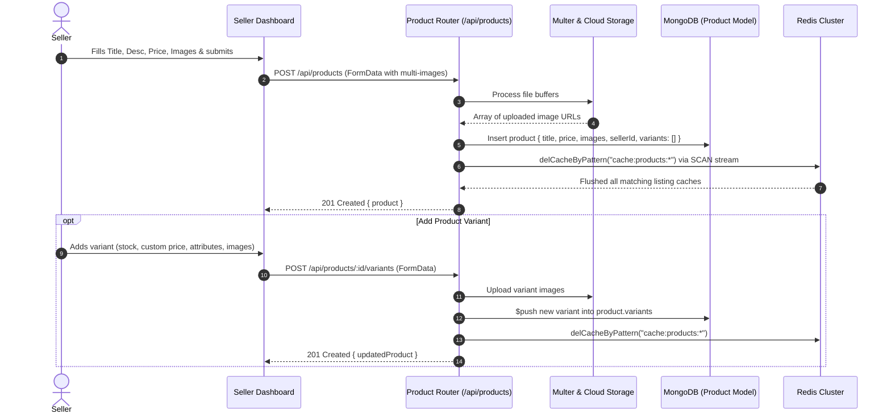
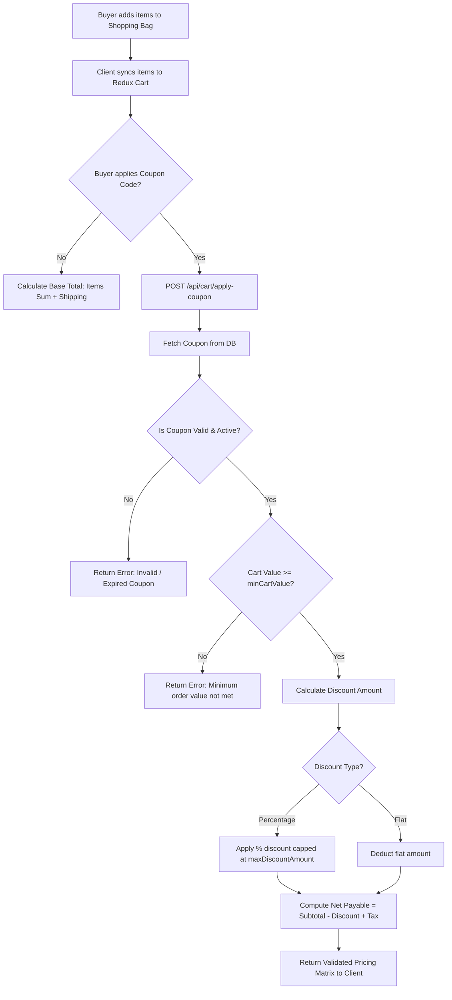
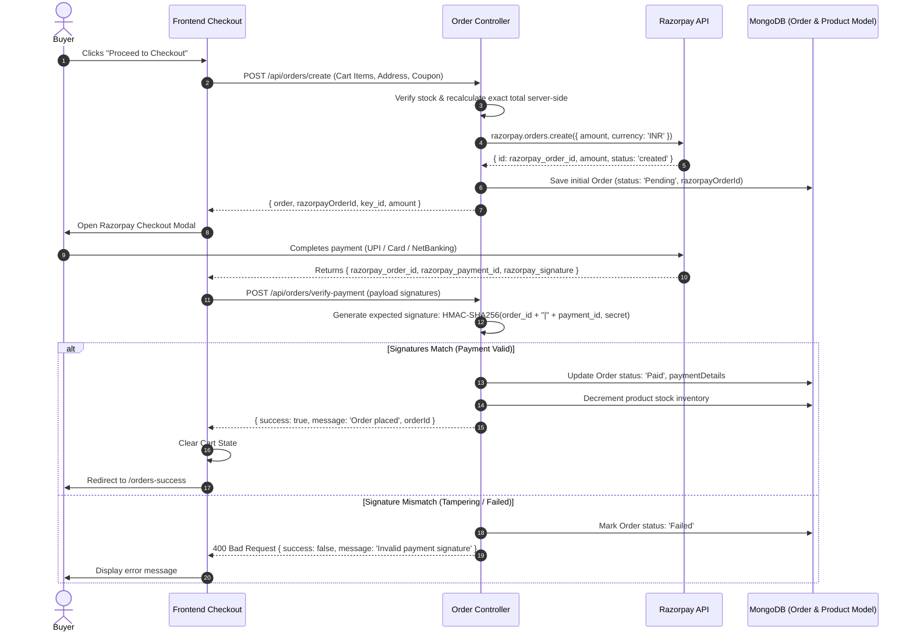
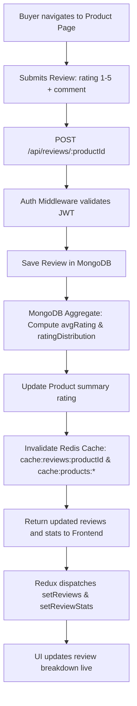

# Luxurisen — System Architecture & Functional Workflows

This document provides complete, end-to-end architectural blueprints and functional workflows for all modules in **Luxurisen**. Each workflow includes step-by-step execution logic, sequence diagrams (Mermaid), data models, and caching/security layers suitable for generating high-fidelity visual diagrams and flowcharts.

---

## Table of Contents
1. [High-Level System Architecture](#1-high-level-system-architecture)
2. [Authentication & Authorization Lifecycle](#2-authentication--authorization-lifecycle)
3. [Product Catalog & Redis Caching Pipeline](#3-product-catalog--redis-caching-pipeline)
4. [Seller Product & Variant Creation Workflow](#4-seller-product--variant-creation-workflow)
5. [Cart & Server-Side Discount Calculation Flow](#5-cart--server-side-discount-calculation-flow)
6. [Checkout & Razorpay Payment Verification Flow](#6-checkout--razorpay-payment-verification-flow)
7. [Product Reviews & Real-time Aggregation Flow](#7-product-reviews--real-time-aggregation-flow)
8. [Distributed Rate Limiting & Fault Resilience Flow](#8-distributed-rate-limiting--fault-resilience-flow)
9. [Summary of Key Files & Controllers](#9-summary-of-key-files--controllers)

---

## 1. High-Level System Architecture



---

## 2. Authentication & Authorization Lifecycle

Handles dual-role registration (Buyer & Seller), encrypted credentials, Google OAuth, and secure token propagation.

### Sequence Flow


---

## 3. Product Catalog & Redis Caching Pipeline

High-speed read pipeline with response caching (`X-Cache: HIT/MISS`) and pattern-based invalidation upon write operations.

### Sequence Flow


---

## 4. Seller Product & Variant Creation Workflow

Enables sellers to create root products, upload multiple high-resolution photos, configure variants with custom attributes (Color, Size, Fabric), and instantly purge stale caches.

### Sequence Flow


---

## 5. Cart & Server-Side Discount Calculation Flow

Prevents price manipulation by calculating totals, caps, discounts, and minimum order validation strictly on the server.

### Process Flow


---

## 6. Checkout & Razorpay Payment Verification Flow

Cryptographically secure two-step checkout with HMAC-SHA256 signature verification.

### Sequence Flow


---

## 7. Product Reviews & Real-time Aggregation Flow

Allows verified buyers to review products with dynamic statistical recalibration.

### Process Flow


---

## 8. Distributed Rate Limiting & Fault Resilience Flow

Dual-tier protection preventing API spam, brute-force login attempts, and DDoS while guaranteeing zero-downtime if Redis is unreachable.

### Strategy Diagram
```mermaid
graph TD
    Req[Incoming HTTP Request] --> Match{Route Pattern?}
    
    Match -- "/api/auth/login" or "/register" --> AuthLimit[Auth Rate Limiter: 10 req / 15 min]
    Match -- "/api/*" (General Endpoints) --> GlobalLimit[Global Rate Limiter: 200 req / 15 min]
    
    AuthLimit --> CheckRedis{Redis Available?}
    GlobalLimit --> CheckRedis
    
    CheckRedis -- Yes --> RedisRateStore[Execute atomic INCR & EXPIRE in Redis]
    CheckRedis -- No (Offline / Reconnecting) --> MemoryFallback[Fallback to in-memory MemoryStore]
    
    RedisRateStore --> EvalLimit{Current Count <= Limit?}
    MemoryFallback --> EvalLimit
    
    EvalLimit -- Exceeded --> Reject[Return 429 Too Many Requests with Retry-After header]
    EvalLimit -- Under Limit --> Pass[Pass through to Route Controller]
```

---

## 9. Summary of Key Files & Controllers

| Module | Primary Frontend Files | Primary Backend Files | Primary Responsibilities |
| :--- | :--- | :--- | :--- |
| **Auth** | [Login.jsx](file:///c:/Users/HARSHAL/OneDrive/College%20Work/Desktop/Cohert%202.0/07-Full%20Stack%20Projects/07%20-%20Snitch/frontend/src/features/auth/pages/Login.jsx), [Register.jsx](file:///c:/Users/HARSHAL/OneDrive/College%20Work/Desktop/Cohert%202.0/07-Full%20Stack%20Projects/07%20-%20Snitch/frontend/src/features/auth/pages/Register.jsx), [Protected.jsx](file:///c:/Users/HARSHAL/OneDrive/College%20Work/Desktop/Cohert%202.0/07-Full%20Stack%20Projects/07%20-%20Snitch/frontend/src/features/auth/components/Protected.jsx) | `auth.routes.js`, `auth.controller.js`, `user.model.js` | Dual-role RBAC, bcrypt hashing, JWT issuance, cookies. |
| **Products & Variants** | [Home.jsx](file:///c:/Users/HARSHAL/OneDrive/College%20Work/Desktop/Cohert%202.0/07-Full%20Stack%20Projects/07%20-%20Snitch/frontend/src/features/products/pages/Home.jsx), [ProductDetail.jsx](file:///c:/Users/HARSHAL/OneDrive/College%20Work/Desktop/Cohert%202.0/07-Full%20Stack%20Projects/07%20-%20Snitch/frontend/src/features/products/pages/ProductDetail.jsx), [SellerProductDetails.jsx](file:///c:/Users/HARSHAL/OneDrive/College%20Work/Desktop/Cohert%202.0/07-Full%20Stack%20Projects/07%20-%20Snitch/frontend/src/features/products/pages/SellerProductDetails.jsx) | `product.routes.js`, `product.controller.js`, `product.model.js` | Catalog browsing, multi-variant inventory, image upload. |
| **Caching & Rate Limiting** | [AppLayout.jsx](file:///c:/Users/HARSHAL/OneDrive/College%20Work/Desktop/Cohert%202.0/07-Full%20Stack%20Projects/07%20-%20Snitch/frontend/src/app/AppLayout.jsx), [product.api.js](file:///c:/Users/HARSHAL/OneDrive/College%20Work/Desktop/Cohert%202.0/07-Full%20Stack%20Projects/07%20-%20Snitch/frontend/src/features/products/services/product.api.js) | `redis.js`, `cache.middleware.js`, `rateLimiter.middleware.js` | Redis response caching (`X-Cache`), invalidations, rate limiting. |
| **Cart & Coupons** | [Cart.jsx](file:///c:/Users/HARSHAL/OneDrive/College%20Work/Desktop/Cohert%202.0/07-Full%20Stack%20Projects/07%20-%20Snitch/frontend/src/features/cart/pages/Cart.jsx) | `cart.routes.js`, `coupon.controller.js`, `coupon.model.js` | Cart persistence, discount caps, price validation. |
| **Orders & Payments** | [OrderDetail.jsx](file:///c:/Users/HARSHAL/OneDrive/College%20Work/Desktop/Cohert%202.0/07-Full%20Stack%20Projects/07%20-%20Snitch/frontend/src/features/orders/pages/OrderDetail.jsx), [OrderSuccess.jsx](file:///c:/Users/HARSHAL/OneDrive/College%20Work/Desktop/Cohert%202.0/07-Full%20Stack%20Projects/07%20-%20Snitch/frontend/src/features/cart/pages/OrderSuccess.jsx) | `order.routes.js`, `order.controller.js`, `order.model.js` | Razorpay order generation, HMAC verification, inventory decrement. |
| **Reviews** | [ProductDetail.jsx](file:///c:/Users/HARSHAL/OneDrive/College%20Work/Desktop/Cohert%202.0/07-Full%20Stack%20Projects/07%20-%20Snitch/frontend/src/features/products/pages/ProductDetail.jsx) | `review.routes.js`, `review.controller.js`, `review.model.js` | Star rating distribution, reviews list, aggregation pipeline. |
